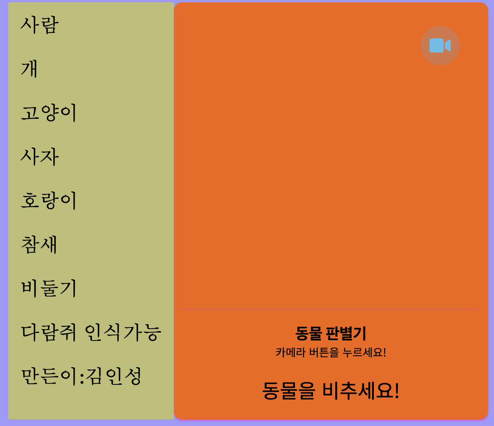
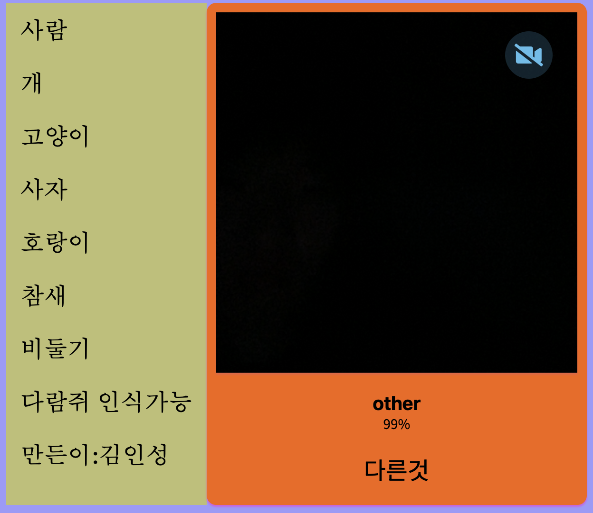

# 동물 판별기 (Teachable Machine 활용)  
> 동계 SW융합 창작 캠프 수료작 (2020.11.21 ~ 11.27)  
> 주제 : **인공지능 모델을 적용한 나만의 홈페이지 만들기**  
> 배포 링크 : [https://danto7632.github.io/template/](https://danto7632.github.io/template/)

---

## 🧑‍💻 제작자

**김인성**  
Teachable Machine 모델 제작 및 웹앱 구현  
> _우수학생 선정 및 상품 AI로봇 획득_

---

## 📌 프로젝트 소개

**Teachable Machine을 활용한 이미지 분류 웹앱**  
웹캠을 이용해 실시간으로 사람과 다양한 동물 이미지를 인식하여 분류하는 머신러닝 기반 웹 프로젝트입니다.

---

## 🎨 화면 구성

| 시작 화면 (카메라 OFF) | 예외 상황 (어두운 화면) |
|:----------------------:|:------------------------:|
|  |  |

| Teachable Machine 메인화면 | 학습 이미지 업로드 화면 |
|:----------------------:|:--------------------------:|
|  |  | 

---

## 🔍 주요 기능

- **총 8개 클래스 분류 가능**
  - 사람, 개, 고양이, 사자, 호랑이, 참새, 비둘기, 다람쥐
- **웹캠 기반 실시간 이미지 분류**
- **Teachable Machine을 통한 머신러닝 학습**
- **어두운 환경 및 예외 상황에 대한 처리 포함**

---

## 📚 클래스별 예시 이미지 (GIF)

| 사람 | 개 | 고양이 | 사자 |
|:----:|:--:|:------:|:----:|
|  |  |  |  |

| 호랑이 | 참새 | 비둘기 | 다람쥐 |
|:------:|:----:|:------:|:-----:|
|  |  |  |  |

---

## 🛠 기술 스택

### 📁 Environment

### 💻 Development

---

## 🔗 참고 링크

- [Teachable Machine 공식 사이트](https://teachablemachine.withgoogle.com/)

---

> 본 프로젝트는 2020년 **대전정보문화산업진흥원 & 우송대학교** 주관의 SW융합 창작캠프 수료작입니다.
